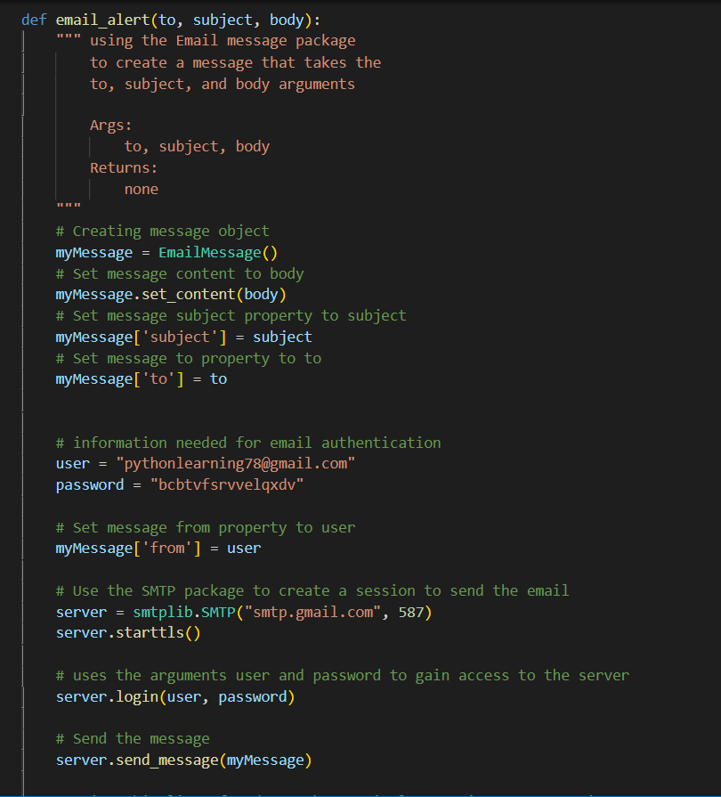
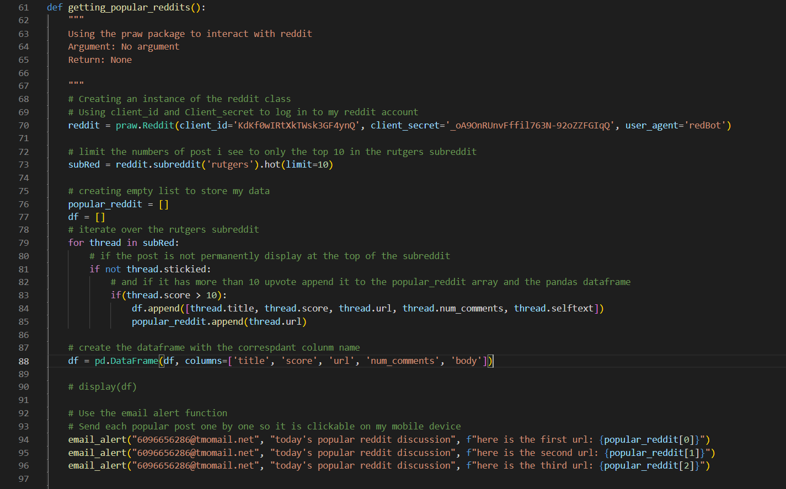
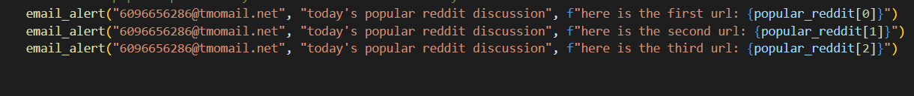
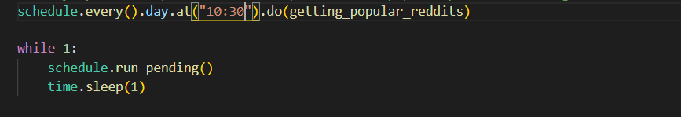
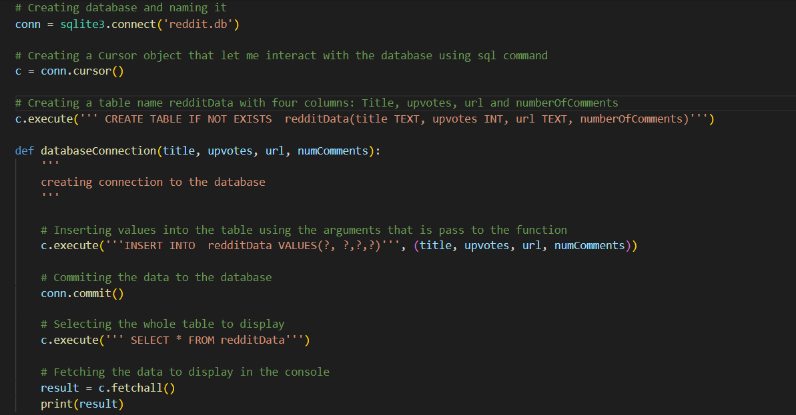

# Python Package Project

The purpose of my project is to send me a text every day at 10:30 am of the most popular topics on the Rutgers subreddit, since I have the reddit app on my phone that link should take me right to the post on reddit. The technology I used was PRAW, a python module that give me access to my reddit account, the python schedule and time library which allow me to schedule the time for my script to run, the smtplib package which enable me to send email to any internet machine with SMTP or ESMTP listener daemon, and the Email Message package which allow me to create an email message. I realized that I needed somewhere to save the data I m getting from reddit, so for my final project I decided to use the sqlite3 package to create a better version of my midterm project. With the sqlite3 package I was able to create a connection to a database and update the database file every time I received the top 3 post message.



The image above displays the function I create in order to generate the message, the function accept three arguments: to, subject and body. By using the Email Message package I can set message properties to the argument I pass to the email_alert function. Furthermore to login into my email account I need my username and password. The user and password variables hold the information I need for authentications. I used the smtplib.SMTP package to start the server and a session, then I used my information to authenticate into the server, then I sent the message. I make sure to printed out “the message was sent successfully” to make sure that my code ran successfully.



In the image above I used the getting_popular_reddits function to gain access to my reddit account. The praw.Reddit function takes my client id and client secret to authenticate me to my reddit account, and I store the reddit information in the reddit variable. By creating this reddit variable I’m able to access many methods and properties that enable me to view reddit information. In order to choose a subreddit to view I used the reddit.subreddit on the reddit variable which allows me to limit how many posts I see on that subreddit. By choosing the Rutgers subreddit I can iterate through the subreddit to find which post I'm looking for, in my case I choose the posts which do not stick to the top of the page and have more than 10 upvotes. If the code has more than 10 upvotes I append its URL to my popular_reddit list and on my df list I append the title, upvotes, URL, numbers of comments, and body text. I create a data frame to save the data I collected and then I text the message to me one by one so I can click on them instead of one giant URL. On Jupiter Notebook I can use display(df) to display the data I collected every time I send a message.



Within the same function I used to get access to my reddit account I used the email alert function which allow me to send an email with a to, subject and body arguments. Since I wanted this application to be convenient, I decided to text myself the top 3 reddit post instead of emailing them. I used an article title How to send a text message from your email account in order to convert my phone number into an email by using the appropriate @gateway address.



I used the schedule and time module of python in order to run the getting_popular_reddits function every day at 10:30 am. The code runs and after a 3 second delay, I get three separate text, and then I can just click on them without wasting time scrolling on reddit.
For my following project I'm thinking of choosing the most controversial topic on the Rutgers subreddit and find out what people think about it. I was thinking of using Textblob and Pandas, I believe that being able to analyze all that data on the Rutgers subreddit will give me an idea on what position the students have taken on a particular topic.

# Saving my data to a database



I needed somewhere to save all the data I was getting from reddit, so I decided to create a database file to save them. As seen in the picture above, by using the sqlite3 package I was able to create a function that takes in the title, upvotes, URL, and number of comments of the top post as arguments and saves them to the database file called “reddit.db”. I called the table “redditData” and it has four columns to take in the information of the top post. By creating a variable for the cursor object I was able to interact with the database using sql commands to insert, commit, and execute my data to the table.

# Install and Run instructions

The user has to have the latest version of python 3 on their computer, then they have to download all the necessary files such as readme.md, requirements.txt., and reddit.py. Before running the main reddit.py file the user has to run the command ``` pip install -r requirements.txt ``` to make sure they install all the packages that are required to run the code.
